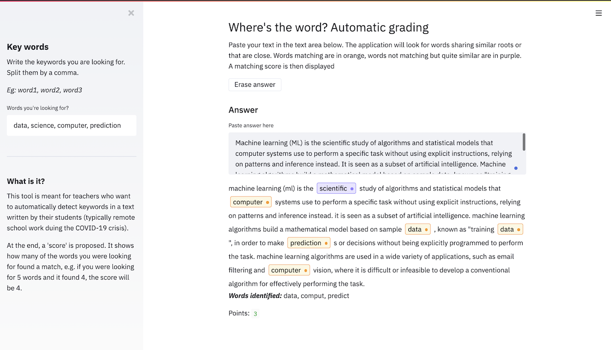

# AutoGrade : A keyword spotting application for teachers

In recent times, with the COVID-19 crises, more and more teachers are going remote and have to correct works from students online. For some tasks, not all, looking for keywords mentioned by students can help review it faster. 

I developed an application to look for a list of keywords in a long text, including not only exact matches, but words that share a common roots (with a stemmer in NLP). I also highlight words that have been recognized as similar, but not enough to count as a match (using levenshtein distance).

 

I then offer a scoring showing how many of the words the teacher was looking for were actually found. The aim of this tool is to drag the attention on the right spots of the text and help teachers review works faster in these times.
